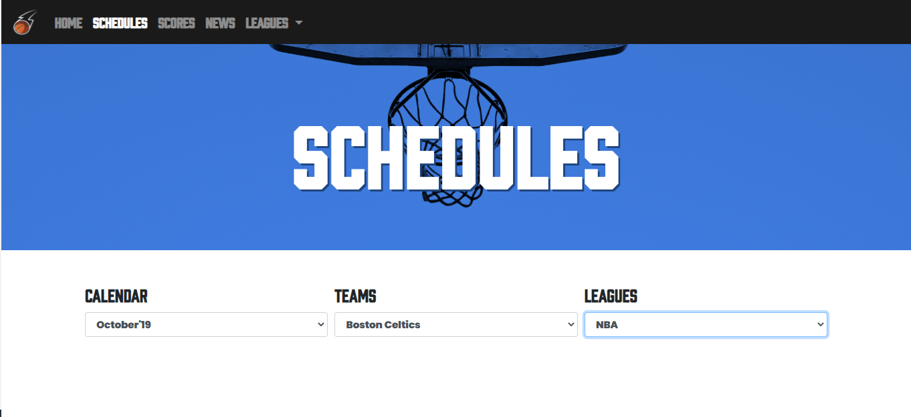

# NBA Web Application

## Link to the live application deployed on Heroku

https://nbaproject2.herokuapp.com/

### Schedules

### News

## Description

* This web application displays various upcoming NBA news and schedules for the teams across the league. The user can navigate through various team schedules and the scores for the day in addition to communicating through a public chat with other NBA fans watching the same scores.

### Usage
* click "use template" next to the clone button, this will create a new repository on your github account
* clone the repository down to your machine
* run the schema.sql query in the mySQL tool of your choice
* run   npm install
* run   touch .env  in the root of your repository
* open the .env file
* add the four environmental variables that will be used to connect to the database:
       DB_PASSWORD=yourpassword
       DB_HOST=127.0.0.1
       DB_USER=root
       DB_NAME=sample_db
* run   npm start to start the server with nodemon which will automatically refresh after any server-side code changes

### **Heroku Deployment**
* you may need to log into the heroku cli, do so by running &nbsp; `heroku login` &nbsp; in the terminal, you will also need the heroku website so might as well log in there too
* run &nbsp;`heroku create` in the root of your project repository.
* you can now run `git push heroku master` to push your application to heroku in its current state.  You will need to do this each time you wish to rebuild your heroku deployment.  You can also set up your repository to automatically push to heroku when you push to github -look around, you will find it!
* select your application on the heroku website
* click "Configure Add-ons"
* type "JawsDB" into the search bar, select "JawsDB MySQL" and provision the "Kitefin Shared - Free" default option
* open the JawsDB instance you have created by clicking on it
* you will be brought to a page with the connection information for your deployed database, which you will need to establish a connection to your production database in the MySQL management tool of your choice

* now it is time to create an instance of your production database in your MySQL management tool.  The following instructions are specifically for MySQL Workbench, but they should apply in a general sense to any tool you are using.
* create a new MySQL connection instance

* give your connection a meaningful name, then using the information from the JawsDB Connection Info page, fill in the connection information on the new connection dialog, click the "store in keychain" button and store your password

* test you connection by clicking the "Test Connection" button at the bottom of the dialog
* if your connection fails, double check that you copied the information correctly
* if your connection succeeds, click into the instance
* don't be alarmed if your schemas panel looks like this, you will still be able to view and query the database: 

* to run queries, dont forget your `USE <DATABASE NAME>;` statement, using the database name you see in the schemas panel:

* now you can manage your deployed production database!

### **Notes About This Database Configuration**
* you now have two databases, a local development database and a deployed production database
* when running your application locally as you develop, it will connect to the local development database using the credentials you supplied in your .env file
* the heroku-deployed application will connect automatically to the deployed production database
* if at any point you with to revert to a clean data set, run the migration/seeder instructions above.  Heroku has a cli that can be accessed by running

        heroku run bash <name of application>
  this will allow you to run the migration and seed commands on the production database manually by running the `npx sequelize-cli...` commands detailed above.

### **To Disable ESLint**
* delete the .eslintrc.js file
* run &nbsp; `npm uninstall eslint`

### **Links and Resources**
* [eslint Getting started page](https://eslint.org/docs/user-guide/getting-started)
* [dotenv NPM Documentation](https://www.npmjs.com/package/dotenv)
* [airbnb styleguide documentation](https://github.com/airbnb/javascript)
